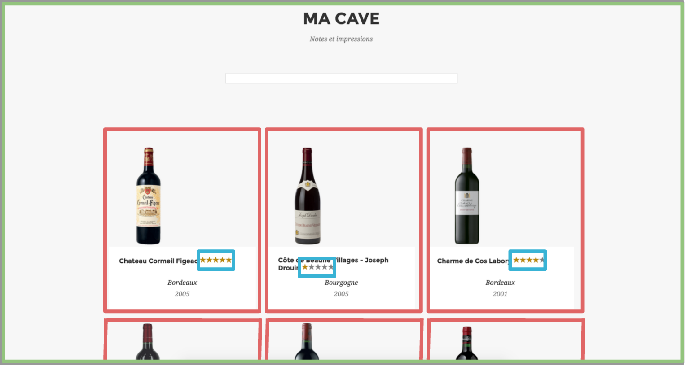

# Etape 1 - Les Directives & Composants
Ce TP a pour objectif de vous familiariser avec les **composants** *AngularJS*.

Positionnez vous dans le répertoire `step-1`.

## Découpage de l'application template en composants
Nous allons maintenant créer notre première version de l'application. Cette version vise à créer les différents composants de notre application. Nous allons démarrer par un découpage du template fourni [ici](sample/home-page.html).

Nous allons découper ce template en trois composants de la manière suivante :


Nous avons identifié trois composants :
* **wine-cellar** : Le composant global, la **cave à vin**
* **wine-card** : Une **carte** correspondant à un type de vin
* **wine-rating** : La **notation** d'un vin

Nous allons créer ces composants dans le répertoire `components` (il s'agit d'une convention).

Pour chaque composant, créez un répertoire. Dans notre cas nous allons créer les répertoires suivants :
* `app/components/cellar` (wine-cellar)
* `app/components/cellar/card` (wine-card)
* `app/components/cellar/rating` (wine-rating)

## Premier composant : wine-card
Nous allons maintenant créer notre premier composant : `wine-card`. Ce composant correspond une carte qui permet de représenter un vin.

Créez le fichier `app/components/cellar/card/card-template.html` qui contient le template du composant :
```html
<div class="col-md-4 col-sm-6 portfolio-item">
  <a href="" class="portfolio-link">
    <div class="portfolio-hover">
      <div class="portfolio-hover-content">
        <i class="fa fa-pencil-square-o fa-3x"></i>
      </div>
    </div>
    
  </a>
  <div class="portfolio-caption">
    <h4 class="ng-binding">Château Chevrol Bel Air
      <div class="ng-isolate-scope">
        <span class="glyphicon glyphicon-star ng-scope wine-no-star"></span>
        <span class="glyphicon glyphicon-star ng-scope wine-no-star"></span>
        <span class="glyphicon glyphicon-star ng-scope wine-no-star"></span>
        <span class="glyphicon glyphicon-star ng-scope wine-star"></span>
        <span class="glyphicon glyphicon-star ng-scope wine-star"></span>
      </div>
    </h4>
    <p class="ng-binding">Bordeaux</p>
    <p class="text-muted ng-binding">2000</p>
  </div>
</div>
```

Créez ensuite le fichier `app/components/cellar/card/CardComponent.js` qui définie le composant :
```javascript
import cardTemplate from './card-template.html';

export default {
  template: cardTemplate,
};
```
Pour l'instant notre composant est très simple, il contient des valeurs par défaut.

Créez le fichier `app/components/cellar/card/Card.js` qui contient module `wine.card` :
```javascript
import CardComponent from './CardComponent';
import angular from 'angular';

export default angular.module('wine.card', [])
                      .component('wineCard', CardComponent);
```

Ce module déclare le composant `wineCard` qui correspond au tag `wine-card` dans le code HTML de l'application. Notez la différence de convention de nommage (**camelCase** dans le js -> **kebab-case** dans le HTML), il s'agît d'une convention *Angular*.

Modifiez ensuite le fichier [`app/app.js`](./app/app.js) pour injecter le module `wine.card` :
```javascript
import angular from 'angular';
import ngAnimate from 'angular-animate';
import ngMessageFormat from 'angular-message-format';
import Card from './components/cellar/card/Card';

export default angular.module('wine', [ngAnimate, ngMessageFormat, Card.name]);
```

L'injection est effectuée à l'aide du tableau passé comme second paramètre de la fonction `module`. `Card` contient le module précédement créé et `Card.name` retourne le nom du module. Il est préférable d'utiliser ce nom plutôt que le nom litéral afin de limiter les erreurs lors des refactorings à venir.

Modifiez à présent le fichier `public/index.html` afin d'y inclure votre nouveau composant en ajoutant `<wine-card></wine-card>`.

Démarrez votre applicaion (`npm start`) et testez le résultat. Vous n'avez plus besoin de redémarrer votre **Webpack Dev Server** durant la suite de ce TP, les changements sont reportés automatiquement.

## wine-card : description

Ajoutez le binding **desc** (*one-way*) à nous permet de passer l'objet contenant la description du vin en propriété du composant `wine-card` :

```javascript
import cardTemplate from './card-template.html';

export default {
  bindings: {
    desc: '<',
  },
  template: cardTemplate,
};
```

Vous pouvez à présent modifier le fichier [`public/index.html`](./public/index.html) afin de passer l'objet décrivant le vin en paramètre du composant :
```html
<wine-card desc="{id:'chantalouette', name:'Château Chantalouette', type:'Rouge', appellation:{name:'Pomerol', region:'Bordeaux'}, rating:1, date:1999, pic:'chantalouette.png'}"></wine-card>
```

Vous devez maintenant, à l'aide des expressions *Angular* (entre **{{}}**), ajouter le contenu dynamique dans le template afin de fusionner les données contenues dans l'objet passé dans `desc`. Dans le template, l'objet est accessible par **$ctrl.desc** (par exemple : **$ctrl.desc.name** donne le nom du vin).

Pour résoudre l'image, vous utiliserez la directive native *Angular* [**ngSrc**](https://docs.angularjs.org/api/ng/directive/ngSrc).

Pour l'instant, nous allons laisser les étoiles telles qu'elles pour pouvoir tester, nous y reviendrons bientôt.

## wine-cellar
Le composant `wine-cellar` est le composant englobant qui regroupe l'ensemble des cartes contenant les vins et qui permet d'éditer les cartes.

Créez le fichier `app/components/cellar/cellar-template.html` qui contient le template du composant :
```html
<section id="portfolio" class="bg-light-gray" ng-hide="$ctrl.editedCard">
  <div class="container">
    <div class="row">
      <div class="col-lg-12 text-center">
        <h2 class="section-heading">Ma cave</h2>
        <h3 class="section-subheading text-muted">Notes et impressions</h3>
        <input ng-model="query" class="col-lg-6 col-lg-offset-3" type="text" class="form-control" />
      </div>
    </div>
    <section id="cards">
      <div class="row">
        <wine-card desc="{id:'chantalouette', name:'Château Chantalouette', type:'Rouge', appellation:{name:'Pomerol', region:'Bordeaux'}, rating:1, date:1999, pic:'chantalouette.png'}"></wine-card>
        <wine-card desc="{id:'charme-cos-labory', name:'Charmede Cos Labory', type:'Rouge', appellation:{name:'Saint-Estèphe', region:'Bordeaux'}, rating:4, date:2001, pic:'charme-cos-labory.png'}"></wine-card>
        <wine-card desc="{id:'cheval-noir', name:'Cheval Noir', type:'Rouge', appellation:{name:'Saint-Emilion', region:'Bordeaux'}, rating:5, date:1997, pic:'cheval-noir.png'}"></wine-card>
        <wine-card desc="{id:'chevrol-bel-air', name:'Château Chevrol Bel Air', type:'Rouge', appellation:{name:'Lalande-de-Pomerol', region:'Bordeaux'}, rating:2, date:2000, pic:'chevrol-bel-air.png'}"></wine-card>
        <wine-card desc="{id:'clarendelle', name:'Clarendelle\'Inspirépar Haut Brion\'', type:'Blanc', appellation:{name:'Bordeaux', region:'Bordeaux'}, rating:2, date:1984, pic:'clarendelle.png'}"></wine-card>
        <wine-card desc="{id:'cormeil-figeac', name:'Chateau Cormeil Figeac', type:'Rouge', appellation:{name:'Saint-Emilion', region:'Bordeaux'}, rating:5, date:2005, pic:'cormeil-figeac.png'}"></wine-card>
        <wine-card desc="{id:'cote-beaune-village', name:'CôtedeBeaune Villages-Joseph Drouin', type:'Rouge', appellation:{name:'CôtedeBeauneVillages', region:'Bourgogne'}, rating:1, date:2005, pic:'cote-beaune-village.png'}"></wine-card>
      </div>
    </section>
  </div>
</section>
<section id ="edit" ng-show="$ctrl.editedCard">
  <h1>EDIT</h1>
  <button type="submit" ng-click="$ctrl.editedCard=undefined" class="btn btn-xl">Return !</button>
</section>
```

Créez les fichiers correspondants pour le composant `wine-cellar` dans le répertoire `cellar`
* `Cellar.js` : le module
* `CellarComponent.js` : le composant

Modifiez les dépendances entre les modules afin d'obtenir les dépendances suivantes :

  `wine` -> `wine-cellar` -> `wine-card`

Attention, `wine` ne doit plus dépendre directement de `wine-card`.

## Mode édition
Vous l'avez peut être remarqué, le composant `wine-cellar` dispose de deux sections. La section qui contient la liste des vins et une seconde section qui permet d'éditer les vins.

Nous allons à présent gérer le passage en mode édition.

Modifiez le composant `wine-card` afin d'ajouter un nouveau binding, *two-way*, appelé **edit** permettant de gérer l'édition des cartes.

Modifiez `wine-cellar` afin d'affecter `$ctrl.editedCard` au binding **edit** dans l'ensemble des cartes. Grâce au **two-way** binding, lorsque cette valeur sera modifiée dans `wine-card`, la valeur sera mise à jour automatiquement dans `wine-cellar`.

A l'aide de la directive [**ngClick**](https://docs.angularjs.org/api/ng/directive/ngClick), ajoutez, dans la balise **a** du template de `wine-card` le comportement permettant d'affecter `$ctrl.desc` à `$ctrl.edit` et de passer ainsi en mode édition.

Comme vous pouvez le remarquer, le changement de mode est effectué à l'aide des directives [**ngShow**](https://docs.angularjs.org/api/ng/directive/ngShow) et [**ngHide**](https://docs.angularjs.org/api/ng/directive/ngHide).

## wine-rating
Nous allons maintenant créer le composant `wine-rating`.

### Filter
Nous allons maintenant créer un filter permettant de gérer l'affichage de la notation (les étoiles).

Dans le répertoire `cellar/rating`, créez les fichiers :
* `RatingRangeFilter.js` : le filter
* `RatingRangeFilter.spec.js` : le test unitaire

Le filter doit, à partir d'un rating, renvoyer un tableau de booléens correspondant à l'état des étoiles qui correspondent au classement du vin, dans le sens décroissant.

Exemple :
* 1 -> [false, false, false, false, true]
* 2 -> [false, false, false, true, true]
* et ainsi de suite...

Créez le filtre **et les tests unitaires** associés.

### Le composant
Créez le fichier `app/components/cellar/rating/rating-template.html` qui contient le template du composant :

```html
<span ng-repeat="star in $ctrl.rating | range track by $index" ng-click="$ctrl.rating = 5-$index" class="glyphicon glyphicon-star" ng-class="{'wine-star': star, 'wine-no-star': !star}"></span>
```

Comme vous pouvez le constater, ce template utilise la directive [**ngRepeat**](https://docs.angularjs.org/api/ng/directive/ngRepeat), nous y reviendrons.

Créez  maintenant les fichiers correspondants au composant `wine-rating` :
* `Rating.js` : le module (n'oubliez pas le filter `range` utilisé dans le template et basé sur `RatingRangeFilter`)
* `RatingComponent.js` : le composant

Ce composant dispose d'un attribut :
* **rating** : la note du vin, *two-way*

Vous pouvez maintenant utiliser ce composant dans le template du composant `wine-card` (dans la balise **h4** à la places des étoiles).

## Prochaine étape

Une fois cette étape terminée, vous pouvez aller consulter la [version corrigée](../step-1-done) puis aller jusqu'à [l'étape suivante](../step-2)
